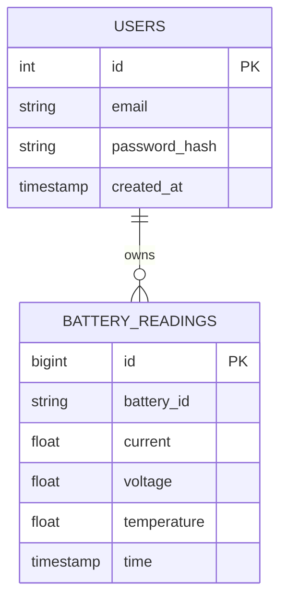

# UML & ERD (Mermaid)



```mermaid
graph TD
  EV[EV Device] -->|POST /api/battery/data| API[Express API]
  UI[React Dashboard] -->|GET /api/battery/:id/:field (JWT)| API
  API --> PG[(PostgreSQL)]
  Admin[Adminer] --> PG
```
